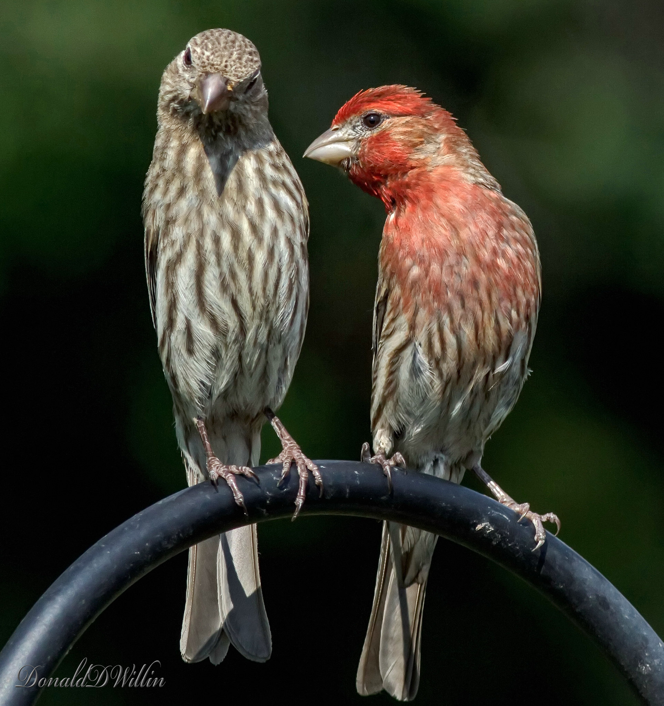

```{r setup, include=FALSE}
library(learnr)
library(gplots)
library(ggplot2)
knitr::opts_chunk$set(echo = TRUE, comment = NA, message = FALSE, fig.width = 5, fig.height = 5)
finch <-
  read.csv(
    "https://github.com/rjknell/Linear_models/raw/master/data/Hill_et_al_finch_coloration.csv"
  )
```

## Multiple continuous explanatory variables.

In much the same way that we can extend the simple ANOVA type linear model to include multiple explanatory factors, we can extend the simple regression type linear model to include multiple continuous explanatory variables --- an analysis that's often called *multiple regression*. This has the same advantages as fitting multiple explanatory factors: we carry out our analysis as a single model fitting exercise rather than as a series of individual analyses; we can detect effects that would otherwise not be found; we can control for the effects of variables statistically; and we can check for interaction terms between our variables. Much of the procedure for dealing with multiple continuous explanatory variables is similar to that for multiple factors so we can jump straight into an example.

## Example: house finch colouration and mitochondrial function

The data we will analyse here come from a study published in 2019 by Geoffrey Hill of Auburn University and co-workers^1^. This research was based on the observation that many animals use visual signals with carotenoids as the pigment in question, and it's now well known that in many cases the redder the visual signal the better the signaller performs in terms of acquiring mates or competing for resources. The mechanism linking red carotenoid signalling to individual quality is not known, however, but Hill *et. al.* followed previous work which had found that many bird species ingest yellow carotenoids but then oxidise these to red pigments, probably in the mitochondria. One part of Hill *et al.*'s investigation into this involved measuring the hue of the red feathers and a series of measures of mitochindrial function in 36 male house finches *Haemorhous  mexicanus* at a time when they were moulting and therefore actively producing red carotenoids.




1. Hill, G.E., Hood, W.R., Ge, Z., Grinter, R., Greening, C., Johnson, J.D., Park, N.R., Taylor, H.A., Andreasen, V.A., Powers, M.J., Justyn, N.M., Parry, H.A., Kavazis, A.N. & Zhang, Y. (2019) Plumage redness signals mitochondrial function in the house finch. Proceedings of the Royal Sociaty B: Biological sciences, 286, 20191354.
